<!-- ============================================================
  JMMM11 - Profile README (tema aurora)
  Repo requerido: github.com/JMMM11/JMMM11
  Archivos propios que usa este README (suelos en el repo):
    assets/banner.svg    -> banner ASCII animado
    assets/divider.svg   -> linea divisora animada
    assets/web-workspace.svg -> espacio de desarrollo web animado
  Paleta: violet · cyan · blue · emerald · amber
============================================================ -->

<div align="center">



<br>

<a href="https://github.com/JMMM11">
  
</a>

<br>


<a href="https://github.com/JMMM11?tab=followers"></a>
<a href="https://github.com/JMMM11?tab=repositories"></a>

</div>

<br>



<!-- ======================= 01 ======================= -->


<table>
<tr>
<td width="55%" valign="top">

I'm a developer focused on building **modern, functional and polished web experiences** designed to work beautifully on computers.

I enjoy working across the entire product lifecycle: from the first idea and interface design to application logic, databases and intelligent features.

> **I don't just want to build software that works.**
> **I want to build software that feels finished.**

</td>
<td width="45%" valign="top">



</td>
</tr>
</table>

<!-- ======================= 02 ======================= -->


<table>
<tr>
<td width="25%" align="center">
<h3>Building</h3>
<sub>Web applications<br>and digital products</sub>
</td>
<td width="25%" align="center">
<h3>Exploring</h3>
<sub>Artificial Intelligence<br>and intelligent interfaces</sub>
</td>
<td width="25%" align="center">
<h3>Developing</h3>
<sub>Full-stack apps and<br>modern architectures</sub>
</td>
<td width="25%" align="center">
<h3>Learning</h3>
<sub>New tech, dev practices<br>and product design</sub>
</td>
</tr>
</table>

<!-- ======================= 03 ======================= -->


<div align="center">

<table>
<tr>
<td align="center" width="33%">
<b>Frontend</b><br><br>
<br>
<sub>HTML · CSS · JavaScript · React</sub>
</td>
<td align="center" width="33%">
<b>Backend</b><br><br>
<br>
<sub>Python · APIs · Authentication</sub>
</td>
<td align="center" width="34%">
<b>Data</b><br><br>
<br>
<sub>PostgreSQL · Supabase · SQL</sub>
</td>
</tr>
</table>

<br>


</div>

<details>
<summary><b>Ver la arquitectura de como construyo (clic para abrir)</b></summary>

<br>

```text
   [ UI / React / Responsive Web ]
              │
              ▼
   [ API · Python · Auth ]
              │
              ▼
   [ Supabase · PostgreSQL ]
              │
              ▼
   [ Producto que se siente terminado ]
```

</details>

<!-- ======================= 04 ======================= -->


<!--
============================================================
Cuando tengas un proyecto, descomenta la tabla y cambia
REPO_NAME por el nombre exacto de tu repositorio.
============================================================

<table>
<tr>
<td width="50%">
<a href="https://github.com/JMMM11/REPO_NAME">
  
</a>
</td>
<td width="50%">
<a href="https://github.com/JMMM11/REPO_NAME_2">
  
</a>
</td>
</tr>
</table>
-->

<div align="center">


</div>


<!-- ======================= 05 ======================= -->


<div align="center">


<br><br>


</div>

<!-- ======================= 06 ======================= -->


<div align="center">


<br><br>

<picture>
  <source media="(prefers-color-scheme: dark)" srcset="https://raw.githubusercontent.com/JMMM11/JMMM11/output/github-snake-dark.svg" />
  <source media="(prefers-color-scheme: light)" srcset="https://raw.githubusercontent.com/JMMM11/JMMM11/output/github-snake.svg" />
  
</picture>

<br><br>


</div>


<!-- ======================= 07 ======================= -->


<table>
<tr>
<td width="20%" align="center"><h3>Design</h3><sub>Make it intuitive.</sub></td>
<td width="20%" align="center"><h3>Code</h3><sub>Make it maintainable.</sub></td>
<td width="20%" align="center"><h3>Performance</h3><sub>Make it fast.</sub></td>
<td width="20%" align="center"><h3>AI</h3><sub>Make it useful.</sub></td>
<td width="20%" align="center"><h3>Details</h3><sub>Make it feel finished.</sub></td>
</tr>
</table>

<!-- ======================= 08 ======================= -->


<div align="center">

I don't believe in adding technology simply because it is popular.
Every tool should have a purpose.

<br>

**Clean code &nbsp;+&nbsp; thoughtful design &nbsp;+&nbsp; useful functionality**

</div>


<div align="center">


Interested in technology, software, AI or building something interesting?

<br>

<a href="https://github.com/JMMM11"></a>
<a href="mailto:jairm9010@gmail.com"></a>
<a href="https://react.dev/"></a>
<a href="https://www.python.org/"></a>

<br><br>

`BUILD` · `LEARN` · `IMPROVE` · `REPEAT`

<sub>Code · Ideas · Real Impact</sub>


</div>
